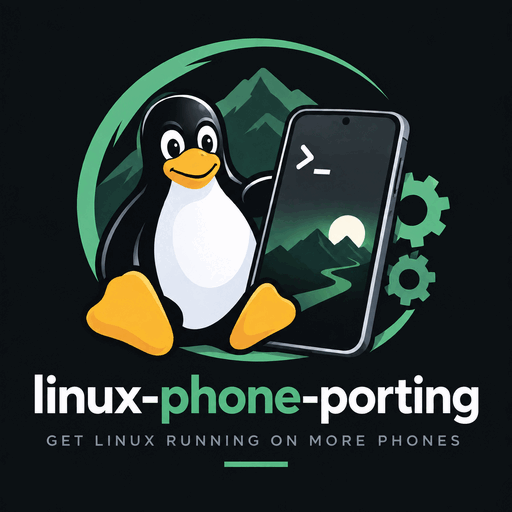

# linux-phone-porting

<p align="center">
  
</p>

An agent skill for porting mainline Linux to a phone. It makes your coding agent gather evidence and do research **before** it writes a fix.

**Contents:** [Why](#why) · [Without the skill vs with it](#without-the-skill-vs-with-it) · [Install](#install) · [Updating](#updating) · [Requirements](#requirements) · [The four phases](#the-four-phases) · [Commands](#commands) · [Folder structure](#recommended-folder-structure) · [Pairs well with](#pairs-well-with) · [Adapting it](#adapting-it) · [Cost](#cost) · [Changelog](#changelog) · [License](#license)

## Why

Every guess on a phone under bring-up costs a build, a flash, and a boot. Five to ten minutes, and most guesses are wrong.

So the skill imposes an order on the session:

1. Back up the stock system while it is still readable — it is also your best research source.
2. Capture evidence from the live device.
3. Research the problem across an ordered, complete list of independent source families.
4. Only then write a fix, one variable at a time.

The skill originated in one real port — mainline Linux on a Xiaomi Mi A3, running NixOS on kernels 7.1 and 7.2 — and now incorporates lessons from other ports while keeping each measurement's scope explicit. The original hardware established which evidence channels survive a wedge and which quietly lose your logs, which observations manufacture the very symptom they are meant to measure, and why the stock DTB pulled off the device beats the sibling SoC's device tree whenever the two disagree. Its evidence notes keep the shape that external review worked against — numbered eliminations, an honest-limits section, and a method block exact enough to repeat — and an outside maintainer's review of those notes, taken as tracked changes, has caught real risks. Transfer the method, not a claim that every device produced the same result.

The target OS is selected by its release, kernel requirements and integration contract, not a distro compatibility list. Named projects below are research destinations. The method covers mainline Linux phone and tablet bring-up and OS userspace integration, including non-GNU userspace; it does not certify a platform/device combination or cover non-Linux kernels.

## Without the skill vs with it

The same workflow, with and without the skill's order imposed:

| Step                          | Without the skill                                                                                                                                                                                                      | With the skill                                                                                                                                                                                                                                                                                                                                                                                              |
| ----------------------------- | ---------------------------------------------------------------------------------------------------------------------------------------------------------------------------------------------------------------------- | ----------------------------------------------------------------------------------------------------------------------------------------------------------------------------------------------------------------------------------------------------------------------------------------------------------------------------------------------------------------------------------------------------------- |
| **Before the first flash**    | Flash the first build straight away. If it corrupts modem NV/EFS or persist, the phone never registers on a network again — and those partitions are in no image on the internet.                                      | Phase 0 first: pin the exact variant and target OS contract, back up every partition except userdata (exclusion ≠ wipe permission), hash and restorability-check the backup, health-check the storage, keep private calibration in a protected runtime path, harvest the stock DTB, firmware layout and vendor configs into a persistent component–wiring–document inventory.                               |
| **Something fails**           | Read the log you happen to have, form a theory, change something, rebuild, reflash. If the debug knobs were off, the evidence for the next attempt is gone — and each attempt costs a build + flash + boot (5–10 min). | Relevant, understood debug facilities enabled before authorized reproduction; full dmesg captured; the actual crash collector and its archive identified (systemd alone proves nothing); flashed payload confirmed by read-back hash; physical limits, pauses and protection telemetry respected.                                                                                                           |
| **Finding the fix**           | Take the first plausible search hit for the symptom — often a different variant of the same phone, with a different panel, touch controller or modem.                                                                  | Research the selected target platform alongside vendor mainline, LKML patch archives, GPL OEM kernel, AOSP, postmarketOS, Halium, Mobian and general-purpose/desktop distribution sources (NixOS among them); map manufacturer datasheets, schematics, FCC exhibits and Scribd documents to the inventory. Compare exact changes and sister-device components; ARM availability alone is not compatibility. |
| **All sources come up empty** | "Nothing exists, this port is impossible." Work stops or gets handed back.                                                                                                                                             | Record no applicable result within searched coverage, with access gaps. Derive the design from primary artefacts (vendor driver, stock DTB, closest mainline driver); missing precedent does not stop evidence-backed implementation.                                                                                                                                                                       |
| **Applying the fix**          | Change, rebuild (tens of minutes), flash, find the build broke on a renamed symbol, repeat. Several variables move at once, so a pass or fail proves nothing.                                                          | One variable per experiment with its falsifier, cheap runtime tests over reflashes, and the pre-build battery before any full rebuild. Deployment is a state machine per the actual platform; completion records must reconcile evidence, permission and unresolved faults. Three refutations route back to research.                                                                                       |
| **Work is worth sharing**     | Patch posted to the first forum that answers, or never shared; duplicates an existing upstream effort; "merged" treated as "my port is fixed."                                                                         | `/port-upstream` (preview): checks whether the work already exists — adopting it counts as success — reads each destination's submission rules, verifies the series against the real base, and hands you a reviewed bundle. You own all maintainer interaction; the ledger tracks prepared → submitted → accepted → merged → released.                                                                      |

The skill does not add capability the agent lacked; it imposes an order that converts each expensive flash cycle into a measured decision.

## Install

**Easiest — ask your agent.** Paste this into Claude Code (or any agent with shell access):

> Install the skill from https://github.com/angelwzr/linux-phone-porting — clone it into an unused `~/.agents/skills/linux-phone-porting`, symlink it into my skills directory, and symlink `commands/*.md` into my commands directory. Inspect existing entries first; preserve any copies or conflicting links rather than overwriting them.

**By hand.** Clone once, link wherever you need it:

```sh
git clone https://github.com/angelwzr/linux-phone-porting ~/.agents/skills/linux-phone-porting

# Claude Code, user-wide
mkdir -p ~/.claude/skills ~/.claude/commands
ln -s ~/.agents/skills/linux-phone-porting ~/.claude/skills/linux-phone-porting
ln -s ~/.agents/skills/linux-phone-porting/commands/*.md ~/.claude/commands/
```

For a single project instead of user-wide, link into `<project>/.claude/skills/` and `<project>/.claude/commands/`.

These commands are for a fresh installation: the clone destination and link names must be unused. Do not add `-f` to get past a collision. Keep one checkout for the skill and all its companion commands, and keep development edits in a separate clone.

The skill is plain markdown with standard frontmatter, so it works in any harness that reads skills. Point that harness at the same clone — one checkout, exposed through links (see [Updating](#updating)). The commands are optional; the skill works without them.

## Updating

Run **`/linux-phone-porting-update`** between hardware sessions. It resolves the installed skill and command links rather than updating whichever development checkout happens to be the current directory. For the manual install above, it verifies the repository and tracking branch, requires a clean worktree with no untracked files or local-only commits, fetches the candidate, shows the old/new revisions and changelog, then fast-forwards to that exact inspected revision. It does not switch channels or discard local work.

Existing links follow the shared checkout, but **new command files need new links**: the install-time wildcard is not a live subscription. The updater adds missing companion links only at vacant destinations in the selected command directories. Copies, dangling links and links into another checkout are reported rather than overwritten. Skill and commands must come from the same revision; a link failure after Git advances is reported as a partial update.

**Bootstrapping an older installation.** If `/linux-phone-porting-update` is not yet discoverable, ask your agent:

> Read the current [linux-phone-porting updater instructions](https://github.com/angelwzr/linux-phone-porting/blob/main/commands/linux-phone-porting-update.md) and carry out that maintenance procedure against my installed skill. Resolve the installed paths first, inspect the fetched revision and changelog, preserve all local work, and add the missing updater and companion command links only at vacant destinations. Do not update a development clone or touch the phone.

This lets the first safe update add the updater link; restart the agent session afterwards to load the new command and skill text. Do not copy only the updater into an old bundle or rerun the wildcard link command with force.

Keep the installed checkout **pull-only**. If it contains local edits, untracked files or local commits, stop and preserve them; review or migrate that work into a separate development clone before retrying. Never reset, stash, force or overwrite to make an update pass. A manager-owned installation uses its discovered, package-scoped update mechanism, not Git in its cache or an update-all command. For manual copies or unknown provenance, the updater proposes a backed-up migration to a fresh clone and links, with separate approval before replacing any installed entries. Network or permission failures leave the update explicitly unverified.

## Requirements

A phone or tablet with a **demonstrated boot path**. On retail-unlock hardware (Android handsets) that means an **unlocked bootloader** — locked devices are out of scope; the skill does not unlock bootloaders and does not advise on unlocking, because unlocking wipes data on most devices and one wrong step can brick the phone — unlock first, through your device maker's own instructions. On exploit-booted hardware the boot path is the payload chain already demonstrated on that device; the skill does not land exploits. On firmware-boot (UEFI) hardware it is a demonstrated way to boot your own image.

## The four phases

| Phase            | What it enforces                                                                                                                                                                                                                                                                                                                                                                                                                                 |
| ---------------- | ------------------------------------------------------------------------------------------------------------------------------------------------------------------------------------------------------------------------------------------------------------------------------------------------------------------------------------------------------------------------------------------------------------------------------------------------ |
| **0. Set up**    | Demonstrated boot path required (unlocked bootloader on retail-unlock targets). Classify the boot model. Pin the exact variant, target OS integration contract, interface/session and boot topology. Back up every readable partition but userdata; exclusion does not authorize wiping it. Verify storage health, inventory components and harvest stock evidence. Discover and prove supported control/recovery operations, not assumed tools. |
| **1. Evidence**  | Understand debug facilities before authorized reproduction. Capture full dmesg, the actual pstore/collector locations and readback identity. Do not increase stress to compensate for missing protection telemetry. Keep physical limits, private data and evidence boundaries explicit.                                                                                                                                                         |
| **2. Research**  | Consult the selected target platform and all source families, including general-purpose/desktop distributions and relevant architecture-independent fixes. Names are research destinations, not compatible-OS claims. Compare components and exact revisions, trace fixes upstream, map hardware documents and preserve conflicts. Missing results remain coverage-qualified and route to primary artefacts.                                     |
| **3. Implement** | One variable per experiment, falsifier before build and cheap checks before a full rebuild. Enforce physical limits and scoped authorization; pauses bind unlimited loops. Verify target-specific deployment states, actual reboot and runtime acceptance before supported cleanup. Three refutations widen research; contradictory completion records block automatic continuation.                                                             |

## Commands

Optional slash commands for individual phases, the full loop, upstream preparation, workspace cleanup, component updates and installation maintenance.

- **`/port-setup`** — _run once, at the start of a port._ Establishes the exact variant, target OS integration contract, interface/session and boot topology, verifies backup and demonstrated control/recovery operations, checks storage health and builds the component/document inventory from stock evidence. Userdata exclusion is not wipe permission.

- **`/evidence-sweep`** — _the device just failed._ Enables relevant, understood debug facilities before authorized reproduction and captures dmesg, actual pstore/collector records, console evidence and readback identity. Physical limits, pauses and private-data rules still apply. The output is evidence, not a diagnosis.

- **`/source-sweep`** — _you have evidence and need answers._ Researches the selected target platform and discovered projects alongside vendor/mainline, mobile-port and general-purpose/desktop distribution sources, plus sister-device and hardware-document evidence. Self-executing and ledger-gated: with the precondition met it opens a coverage ledger and fans out one subagent per source family without operator prompting, and a question closes only when every applicable family carries a finding or a recorded gap. ARM packages and architecture-independent fixes are candidates, not proof of phone support. The source procedure in `SKILL.md` is authoritative. Reports applicability and access gaps, then ranks hypotheses.

- **`/port-research`** — _you have been asked to build something that has never worked._ The same sweep entered from the other side: no crash log, so the device data is the phase 0 material. Ends with a plan and its sources attached, not a hypothesis about a symptom.

- **`/flash-gate`** — _you have a fix and it is about to cost a boot._ Six hypothesis/evidence questions plus mandatory safety prerequisites: scoped permission, physical limits, protection and private calibration. Any failed gate blocks the experiment. The selected platform's pre-build battery runs before a full rebuild; real reboot/runtime checks gate cleanup.

- **`/port-loop`** — _you want a capability working and are happy to let the agent iterate._ Asks for a refutation budget (5, 15, or unlimited), then researches, gates, applies authorized tests, verifies and records. Every third refutation widens scope. Pauses, physical limits and permission boundaries bind unlimited loops too; protected writes and userdata loss require separate authorization. Completion records distinguish target success from unresolved faults and preserve history.

- **`/port-upstream`** — _a fix or capability is portable and worth offering upstream._ Checks whether the work already exists (adopting it counts as success), reads each destination's current submission rules, prepares and verifies the series against the real base, and hands you a reviewed bundle with suggested messages. You own all maintainer interaction; the command tracks prepared → submitted → accepted → merged → released in a ledger and turns review feedback into revisions.
- **`/port-cleanup`** — _disk pressure on a porting workspace._ Inventories stale artifacts, old shared kernel/OS bases, abandoned build outputs and store closures with measured sizes, proves each candidate unreferenced by the current port before proposing it, and deletes only what the operator confirms item by item. Afterwards it re-checks references, builds and paths and reports the space actually freed. Workspace-only: the phone and the device-side cleanup gate stay with phase 3.
- **`/port-update`** — _a newer kernel, app or component release is out and the port should take them in one pass._ Inventories pinned versions as rollback anchors, frames targets with a pre-bump regression sweep, orders components by dependency, and applies one class per gated deployment cycle — patch absorption checks, config migration, per-component verification and a regression pass over already-working capabilities included. A post-batch device health gate (reboot persistence, failure surfaces, storage re-probe, power, channels) blocks the run from closing on a sick device; failures hold the batch, and `/port-cleanup` closes it.
- **`/linux-phone-porting-update`** — _you explicitly want to maintain the installed skill._ Verifies install provenance and channel, reviews the fetched changelog, fast-forwards a clean Git installation to the inspected revision, and reconciles companion links without overwriting local work. Runs outside the hardware phases; never self-updates from `/port-loop`.

`/source-sweep` and `/port-research` are the same phase approached from opposite directions — one starts from a symptom, the other from a request — and both feed `/flash-gate`. Each command states its own precondition, so you can start anywhere.

## Recommended folder structure

Phase 0 sets the working conventions, including where everything lives. The reference layout for a multi-device workspace is layered — each layer owns one kind of decision, and dependencies point one way only:

```text
kernel/<version>/     Clean upstream source + generic builder
soc/<vendor-soc>/     SoC-common patches, configuration and packages
os/<platform>/        Device-neutral OS integration and tools
devices/<model>/      Device assembly, patches, calibration and state
```

- **Dependency direction:** `kernel → soc → os → devices`. Bases never import device layers; device-shaped input enters shared layers only through function arguments.
- **Bases stay clean.** No device patches, no device names in `kernel/`, `soc/` or `os/`. A shared kernel working tree used for experiments is marked as patched, never mistaken for pristine upstream.
- This is a reference shape, not a restructuring order: preserve existing directory names and ownership boundaries. `artifacts/android/` identifies actual Android captures, not a restriction on the target OS.

**Everything large, private, or device-derived lives under `artifacts/` at the device project root** — gitignored, never committed, never unignored — classified by what it is:

```text
artifacts/
  private/           Device-unique material that never leaves the machine
                     (the partition backup first of all, with a
                     DO-NOT-RESTORE note for userdata inside it)
  firmware-harvest/  Extracted blobs pending redaction
  android/           Reproducible stock-ROM packages and rooted captures
  debug-evidence/    Irreplaceable captures and preregistrations
  reference/         Reading copies of upstream sources
logs/                One subdirectory per boot
```

Publishable firmware is different: it goes to a sibling `firmware-publishable/` repository with its own git history, derived only after redaction. A README at the device project root maps every path to its class, with hashes.

## Pairs well with

The skill invokes companion skills **by name**, each with a plain-tools fallback when it is not installed. Nothing breaks if you install none of them — the skill works end-to-end on base capabilities — but research and source navigation get better with them:

- **`linux-kernel-development`** (fallback: `linux-kernel-crash-debug`, then any subsystem-specific kernel skill) — to work out which driver, binding or firmware interface owns a failure, to read a failing dmesg and choose debug knobs during evidence capture, and to reason about a change during implementation. Without any of them, the agent reasons through the driver sources and `Documentation/` directly.

- **`find-docs`** (Context7-backed) — current documentation rather than recalled signatures: kernel-side too (DT bindings, Kconfig, subsystem docs for the exact kernel version being built), the userspace libraries involved, and the build/image tooling before any assembly. Without it, the agent reads the project's docs over the web, or the kernel tree's `Documentation/` for kernel interfaces.

- **`wigolo`** — for the phase 2 source sweep and phase 0's spec-sheet and custom-ROM lookups; its local cache is the part that matters, since consecutive sessions of a port re-read the same handful of pages. Without it, the agent uses plain web search.

- **`graft`** — optional navigation for an indexed source tree: locate symbols, callers and relevant spans before broad searches. The exact checked-out source remains authoritative; an index or summary is a pointer, not patch evidence. Without it, use direct source search and reads.
- **`lei`** (public-inbox CLI, not an agent skill) — optional local query interface for the lore.kernel.org archives named in phase 2: diff-targeted prefixes (`dfn:` filename, `dfhh:` hunk header) reach patch threads touching an exact driver file or function, and saved searches (`lei q` / `lei up`) follow a subsystem while a port iterates. Without it, the lore web interface is the fallback.

Any skill covering the same capability can substitute — the names are the defaults the skill tries first, not hard dependencies.

## Adapting it

The skill is deliberately device-agnostic: no tool paths, no partition names, no hashes. Keep your own port's specifics in your project's `CLAUDE.md` or a sibling skill, and leave this one as the method.

## Cost

The skill is ~10,500 words (~19 k tokens) and loads in full every device session. A command adds 1,200–2,100; a typical mid-port iteration (SKILL.md + one command) runs ~20–21 k tokens — under 10 % of a 200 k context.

The cost buys measured failure prevention. Each rule encodes a specific incident from a real port, with the numbers that justify it:

- A pwn-session misdiagnosis cost ~3 h; the session-mechanics rules exist to prevent that class.
- Four consecutive kernel rebuilds were burned on unchecked missing symbols; the pre-build battery rule (apply-check, symbol check, Kconfig check, unit compile) prevents exactly that sequence.
- A 28 MiB reserved-memory shortfall caused ~340 hard wedges before a region-by-region diff found it; the reserved-memory diff rule encodes the fix.

One prevented misdiagnosis covers ~100 sessions of the token cost. Reduction was tested rather than assumed: a compression audit (2026-09-26) measured the reduction ceiling at ~60 words across 18 fresh-context controls (15 passed, 1 gap closed and fixed, 2 covered-adjacent). The remaining density is falsifiers, numbers and boundary conditions — the part that makes the rules checkable.

## Changelog

- **2026-09-26**
  - **Coverage audit as the update's test method.** A seven-device source harvest (142 candidates) triaged through "no guidance without a failing baseline": 18 fresh-context controls against the pre-edit skill — 15 passed, 1 failed (web-source pinning, below); per-candidate dispositions recorded in the audit of record. Harvest broadly, then let passing/failing controls decide what earns wording.
  - **Web-source pinning in the phase-2 sweep ledger.** Mutable web sources are pinned at access time (wiki oldid/last-modified, branch commit hash); unpinned entries are method gaps to re-fetch, not evidence; search-synthesized assertions are discarded when a primary read contradicts them. Compression audit measured the remaining ceiling at ~60 words — density is the value; not pursued.
  - **Cost section in the README.** Documents the load cost (~19 k tokens/session, ~20–21 k with one command) and its justification: every rule is incident-backed, one prevented misdiagnosis outweighs ~100 sessions of token spend, and the compression audit bounds safe reduction at ~60 words.
  - **Inventory the port tree before declaring a capability missing.** A greenfield-driver conclusion from upstream sources alone was refuted by the port's own patch series already carrying the full stack; the port's series is now the first research family, with the live `uevent`/dmesg check as the one-command refutation.
  - **Per-device priority measurement.** A power gap that killed one device did not transfer to the next; a ten-minute passive power-supply capture cancelled a proposed bring-up priority.
  - **In-place recovery for one-direction-dead USB networking.** UDC unbind/rebind + gadget-unit restart over a surviving serial channel restored the link in ~23 s with `boot_id` unchanged, after an interface bounce alone had failed.

Full history in [CHANGELOG.md](CHANGELOG.md).

## License

[CC BY 4.0](LICENSE) © [Roman Linev](https://rlinev.ru).
